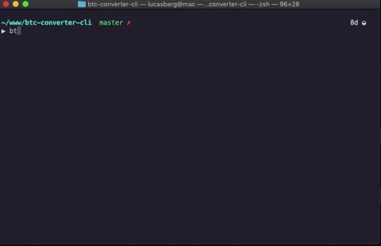

# Bitcoin Converter CLI

> Convert Bitcoin to any currency defined.



### Installing

```
$ npm install -g btc-currency-converter
```

### How to use

```sh
btc-converter --help

  Usage: btc-converter [options]

  Convert Bitcoin to any currency defined.

  Options:

    -V, --version              output the version   number
    -C, --currency <currency>  Currency to be   converted. (Default: USD)
    -A, --amount <amount>      Value in Bitcoin to  convert. (Default: 1)
    -h, --help                 output usage   information
```

### Contributing

Please read [CONTRIBUTING.md](https://gist.github.com/PurpleBooth/b24679402957c63ec426) for details on our code of conduct, and the process for submitting pull requests to us.

### Versioning

We use [SemVer](http://semver.org/) for versioning. For the versions available, see the [tags on this repository](https://github.com/your/project/tags).

### License

This project is licensed under the MIT License - see the [LICENSE.md](LICENSE.md) file for details
